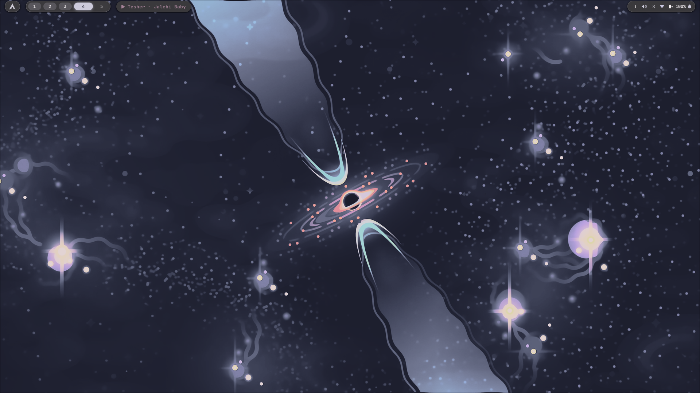
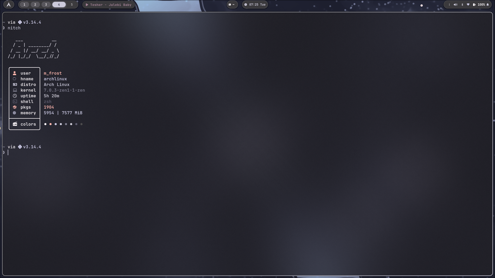

<div align="center">

# FrostCalibr's Dotfiles

My personal [Hyprland](https://hyprland.org/) configuration.


</div>

---

##Screenshots

<details open>
<summary><b>Overview</b></summary>
<br>

| Desktop                                  | Terminal                                  |
| ---------------------------------------- | ----------------------------------------- |
|  |  |

</details>

<details>
<summary><b>More Shots</b></summary>
<br>

 
 


</details>

---

## Setup

| Category | Tools |
| :--- | :--- |
| **Window Managers / Compositors** | [Hyprland](https://hyprland.org/), [Niri](https://github.com/Swayer/niri) |
| **Status Bar** | [Waybar](https://github.com/Alexays/Waybar) |
| **App Launcher & Menus** | [Rofi](https://github.com/davatorium/rofi) |
| **Terminal Emulator** | [Kitty](https://sw.kovidgoyal.net/kitty/) |
| **Text Editors / IDEs** | [Neovim](https://neovim.io/), [Zed](https://zed.dev/), [Micro](https://github.com/zyedidia/micro), [VSCodium](https://vscodium.com/) |
| **Shell & Prompt** | Zsh + [Starship](https://starship.rs/) |
| **File Manager** | [Superfile](https://github.com/yorukot/superfile) |
| **System Monitors** | [Btop](https://github.com/aristocratos/btop), [Bottom](https://github.com/ClementTsang/bottom), [Htop](https://htop.dev/) |
| **Desktop Shell / Widgets** | [Quickshell](https://github.com/outfoxxed/quickshell) |
| **Notification Center / OSD** | [SwayNC](https://github.com/ErikReider/SwayNotificationCenter), [SwayOSD](https://github.com/ErikReider/swayosd) |
| **Theme / Color Generators** | [Matugen](https://github.com/InioAsano/matugen), [Kvantum](https://github.com/tsujan/Kvantum) |
| **Music Player & Theme** | [Spotify Player](https://github.com/aome510/spotify-player) + [Spicetify](https://spicetify.app/) |
| **Clipboard & Visualizers** | [Greenclip](https://github.com/erebe/greenclip), [Cava](https://github.com/karlstav/cava) (audio visualizer), [Fastfetch](https://github.com/fastfetch-cli/fastfetch) |
| **Terminal Dashboard** | [WTF](https://wtfutil.com/) |
| **AUR Helper / Search** | [Pacseek](https://github.com/moson-ick/pacseek) |
| **Wallpaper Daemon** | [awww](https://codeberg.org/LGFae/awww) |

---

## ⚠️ Notes

### Wallpaper

The wallpaper path in `.config/hypr/colors.conf` points to:

```
~/Pictures/Wallpaper/Everforest/waterfall.png
```

- If the script gets stuck on **"Applying..."**, close it, reopen, then apply
  again.
- Check terminal logs if errors occur.
- And the option `close to fallback` has some errors. i wont recomend

### Spicetify

The `spotify_path` in `.config/spicetify/config-xpui.ini` is set for the
[`spotify-launcher`](https://aur.archlinux.org/packages/spotify-launcher) AUR
package. If you use the regular `spotify` package, update the path accordingly.

---

## Credits

- Rofi applets based on [adi1090x/rofi](https://github.com/adi1090x/rofi)
- Waybar theme based on
  [HANCORE-linux/waybar-themes](https://github.com/HANCORE-linux/waybar-themes)
