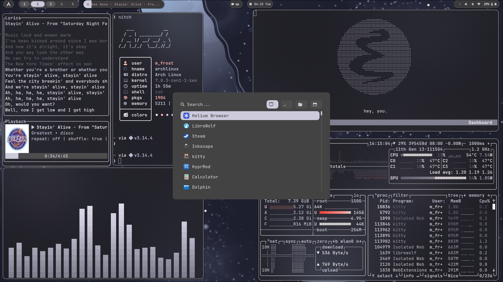
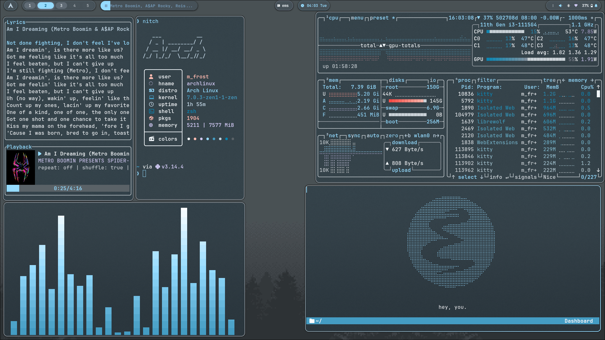
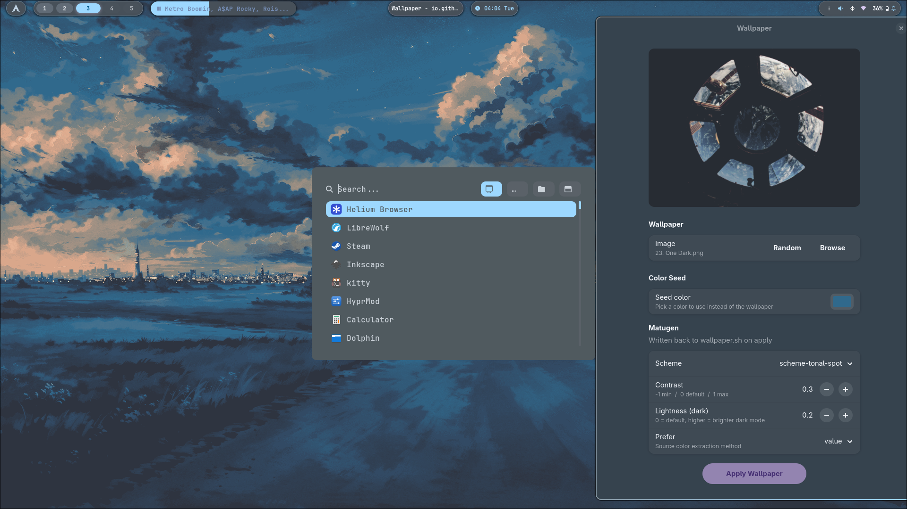
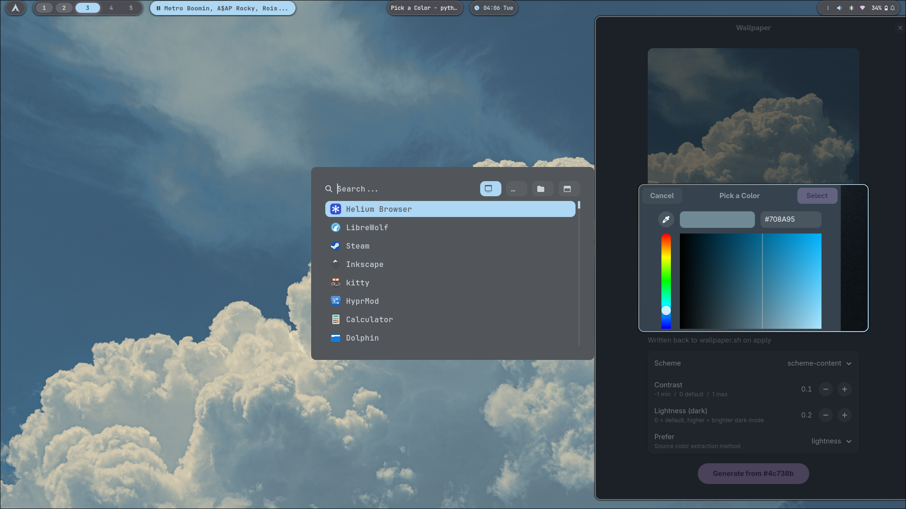
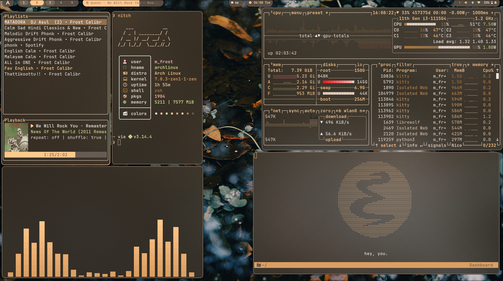
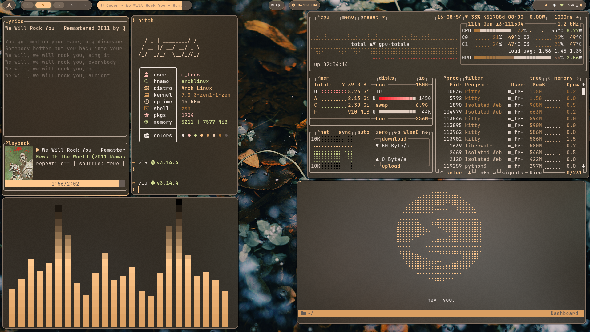
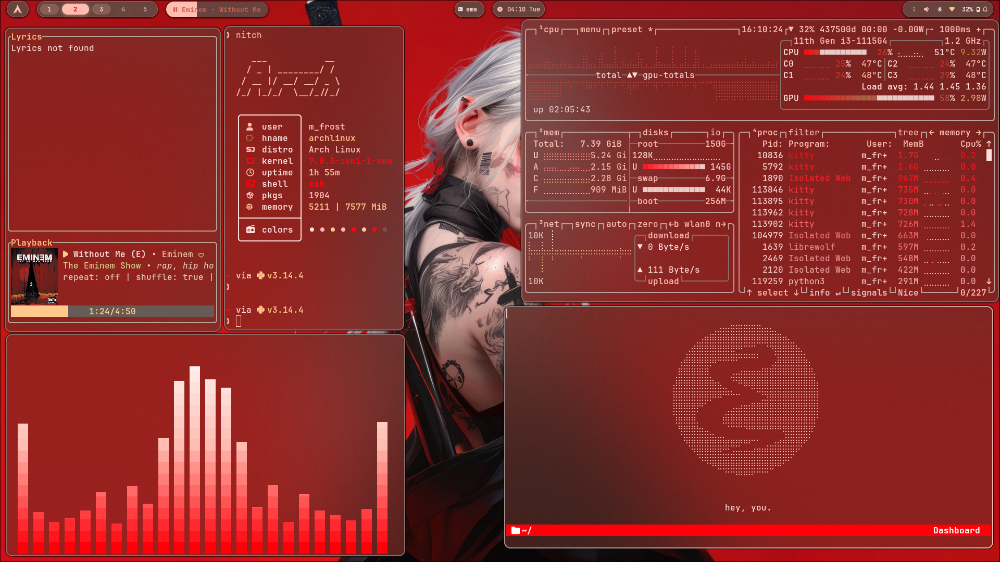
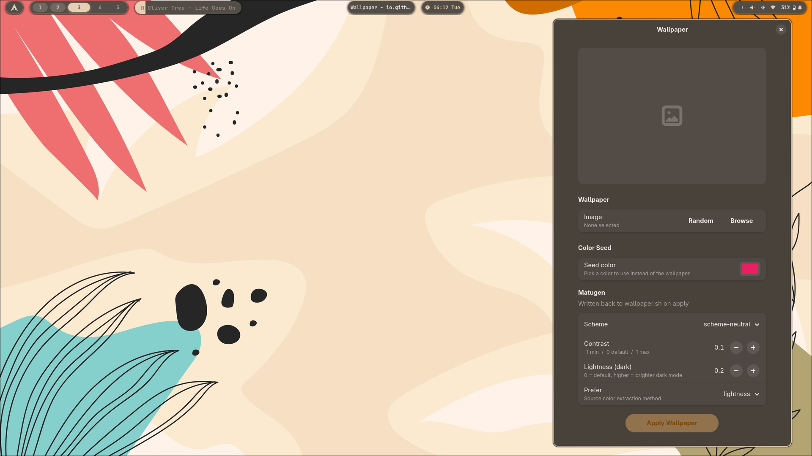
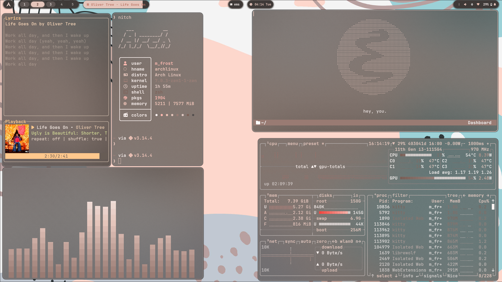

<div align="center">

# FrostCalibr's Dotfiles

My personal [Hyprland](https://hyprland.org/) configuration.



</div>

---

##Screenshots

<details open>
<summary><b>Overview</b></summary>
<br>

| Desktop                                  | Terminal                                  |
| ---------------------------------------- | ----------------------------------------- |
|  |  |

</details>

<details>
<summary><b>More Shots</b></summary>
<br>

 
 
 

</details>

---

## Setup

| Component     | Tool                                        |
| ------------- | ------------------------------------------- |
| **WM**        | [Hyprland](https://hyprland.org/)           |
| **Bar**       | [Waybar](https://github.com/Alexays/Waybar) |
| **Launcher**  | [Rofi](https://github.com/davatorium/rofi)  |
| **Terminal**  | [Kitty](https://sw.kovidgoyal.net/kitty/)   |
| **Wallpaper** | [awww](https://codeberg.org/LGFae/awww)     |

---

## ⚠️ Notes

### Wallpaper

The wallpaper path in `.config/hypr/colors.conf` points to:

```
~/Pictures/Wallpaper/Everforest/waterfall.png
```

- If the script gets stuck on **"Applying..."**, close it, reopen, then apply
  again.
- Check terminal logs if errors occur.
- And the option `close to fallback` has some errors. i wont recomend

### Spicetify

The `spotify_path` in `.config/spicetify/config-xpui.ini` is set for the
[`spotify-launcher`](https://aur.archlinux.org/packages/spotify-launcher) AUR
package. If you use the regular `spotify` package, update the path accordingly.

---

## Credits

- Rofi applets based on [adi1090x/rofi](https://github.com/adi1090x/rofi)
- Waybar theme based on
  [HANCORE-linux/waybar-themes](https://github.com/HANCORE-linux/waybar-themes)
